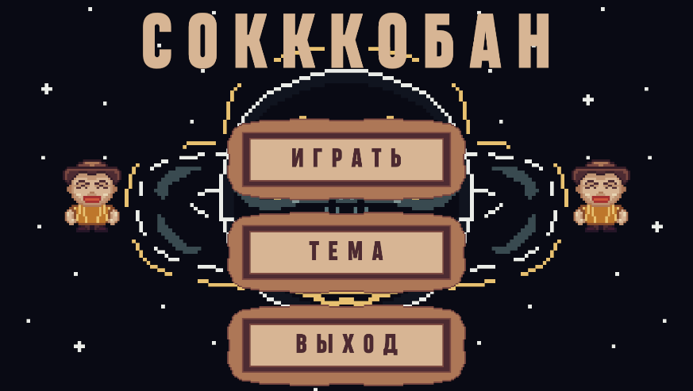
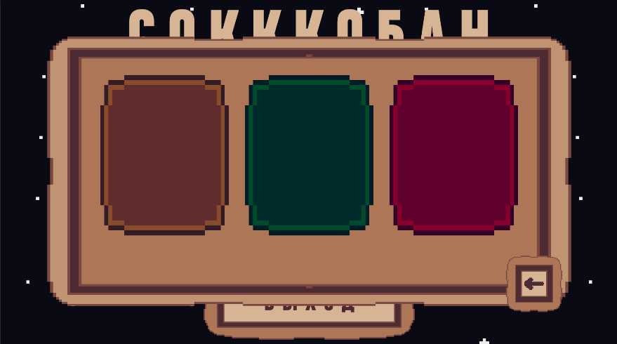
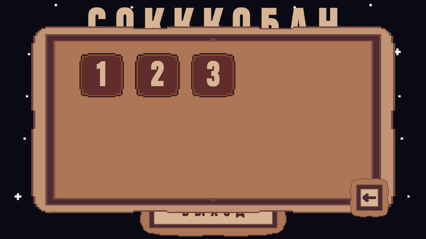
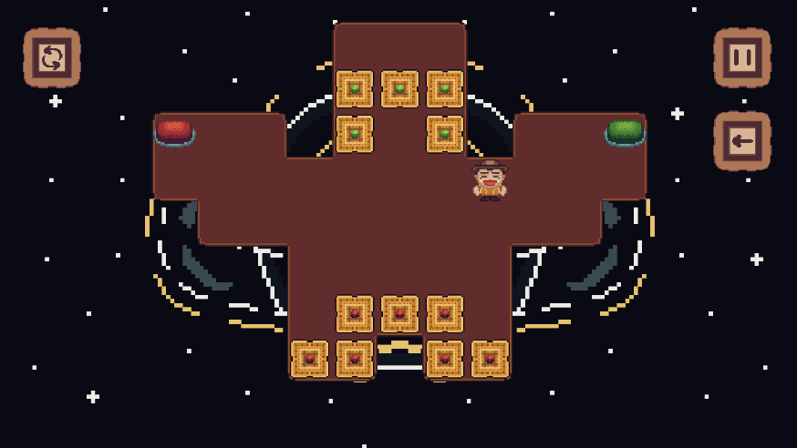

# Sokkkoban

**Sokkkoban** — 2D-головоломка в жанре Sokoban, разработанная на Unity с использованием C#. Игрок перемещает ящики по игровому полю, взаимодействует с окружением и решает пространственные головоломки.

## Реализованные механики

- Пошаговое перемещение персонажа по сетке.
- Перемещение ящиков по игровому полю с учётом допустимости ходов.
- Построение игровых уровней с использованием Unity Grid и Tilemap.
- Проверка столкновений и обработка взаимодействий с игровым окружением.
- Использование Unity Physics 2D для обнаружения игровых объектов.
- Анимации движения персонажа и ящиков.
- Механика падения объектов.
- Отмена последнего хода (Undo).
- Перезапуск текущего уровня.
- Проверка условий победы.
- Главное меню и навигация между игровыми сценами.
- Выбор уровней.
- Смена тем оформления.
- Сохранение пользовательских настроек.

## Технологии

- **Unity** — игровой движок.
- **C#** — реализация игровой логики.
- **ООП** — организация игровых компонентов и их взаимодействия.
- **Unity UI** — пользовательский интерфейс.
- **Unity Grid и Tilemap** — организация игрового поля.
- **Unity Physics 2D** — обнаружение объектов и обработка взаимодействий.
- **ScriptableObject** — хранение игровых данных.
- **Prefabs** — создание и повторное использование игровых объектов.
- **Animator** — анимация персонажа и объектов.
- **Coroutines** — управление анимациями и временными игровыми процессами.
- **C# Events / Action** — взаимодействие между игровыми компонентами через события.
- **PlayerPrefs** — сохранение пользовательских настроек.

## Скриншоты

### Главное меню



### Смена тем оформления



### Выбор уровней



### Игровой процесс



## Запуск проекта

1. Клонировать репозиторий:

   ```bash
   git clone https://github.com/Kirliffilan/Sokkkoban.git
   ```

2. Открыть проект в Unity.
3. Открыть основную игровую сцену.
4. Запустить игру через Unity Editor.

Версию Unity можно посмотреть в файле `ProjectSettings/ProjectVersion.txt`.

## О проекте

Проект разработан в рамках учебной деятельности для практики создания 2D-игр на Unity. В процессе разработки реализованы пошаговое перемещение объектов по сетке, взаимодействие с игровым окружением, анимации, система отмены ходов, управление уровнями и пользовательскими настройками.

Особое внимание уделено организации игровой логики, взаимодействию компонентов и реализации механик, характерных для жанра Sokoban.
